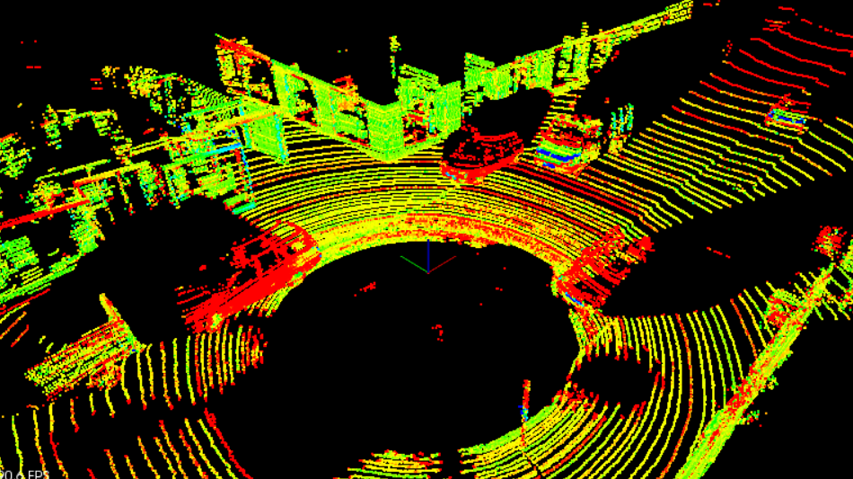
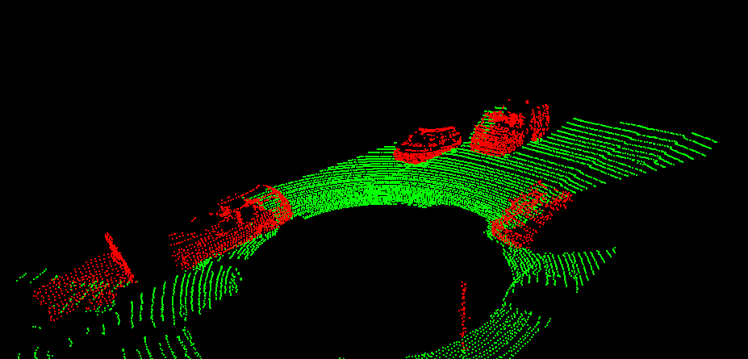
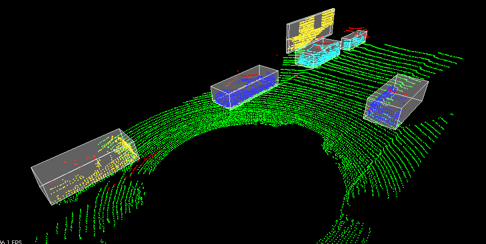
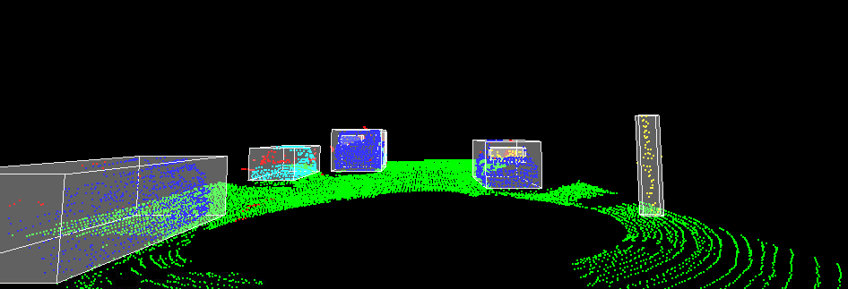

# Lidar Obstacle Detection
This repository contains the C++ code developed to detect objects in a point cloud stream.

## Table of Contents
  - [Project Objective](#project-objective)
  - [Detection Pipeline](#detection-pipeline)
    - [RANSAC](#ransac)
    - [KD-Tree](#kd-tree)
    - [Euclidean Clustering](#euclidean-clustering)
    - [Stream Real Point Cloud Data](#stream-real-point-cloud-data)
- [Compiling and Running the Executable](#compiling-and-running-the-executable)
  
## Project Objective
This project aims to detect objects from a point cloud stream of traffic on a street. The baseline code which includes LiDAR streaming, preliminary point cloud segmentation, and clustering, was developed in previous lessons leading up to this project. 

## Detection Pipeline
For this project submission, the following tasks were completed for object detection:
1. Implement RANSAC: used to separate the point cloud between road plane and obstacle plane 
2. Create KD-Tree structure: a quick and efficient search algorithm that searches for groups of points within the point cloud
3. Implement Euclidean clustering: identifies objects from the KD-tree groups and encompasses the groups with a bounding box
4. Stream real point cloud data: detect object in real time in a point cloud stream

After segmenting the point cloud, the object plane is used for object detection.

  |
:--:|:--:
*Point cloud before Segmentation*| *Segmented point cloud with road plane (green points) and object plane (red points)*

# Compiling and Running the Executable

To run the above project, clone the repository by 
```shell
git clone 
```
Now go to Lidar-Obstacle-Detection folder
```shell
cd Lidar-Obstacle-Detection/
```
Now create a build folder and go to it
```shell
mkdir build && cd build 
```
Run the following command to build system generator
```shell
cmake ..
```
Run the following command to drive the compiler and other build tools to build the code
```shell
make
```
Run the code by entering following in the terminal
```shell
./environment
```
## Results





